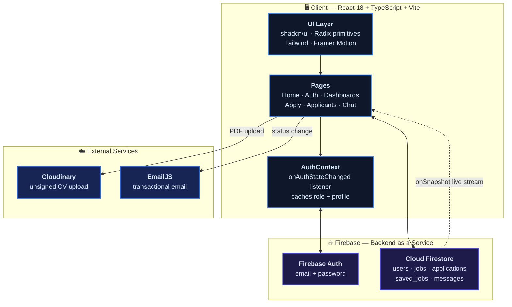
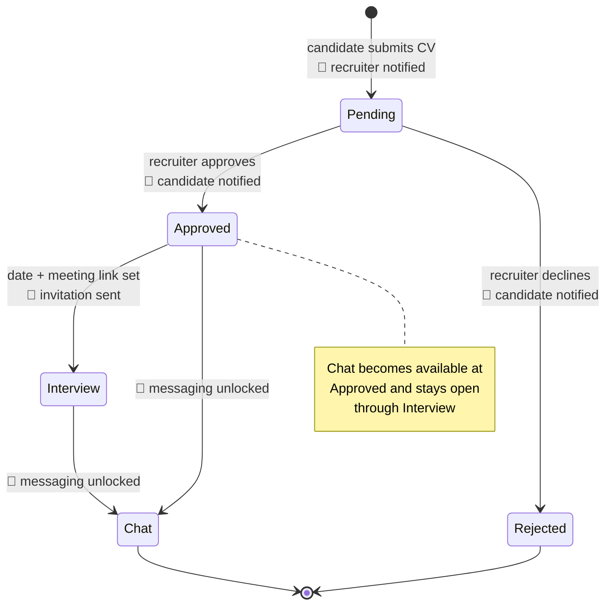

<!-- ============================ ANIMATED HEADER ============================ -->
<p align="center">
  
</p>

<p align="center">
  <a href="https://job-connect-delta-woad.vercel.app/">
    
  </a>
</p>

<p align="center">
  <a href="https://job-connect-delta-woad.vercel.app/"></a>
</p>

<p align="center">
  
  
  
  
  
  
</p>

<p align="center">
  <a href="#-the-team"></a>
  <a href="#-features"></a>
  <a href="#-architecture"></a>
  <a href="#-design-system"></a>
  <a href="#-getting-started"></a>
</p>


## 🚀 What This Is

**JobConnect** is a serverless recruitment platform that closes the loop between recruiters and job
seekers — from posting a role, to applying with a CV, to getting approved, to scheduling the
interview, to chatting in real time. No backend server, no cron jobs, no polling.

The whole thing runs on **Firebase + EmailJS**, so the app is pure frontend and still does
everything a hiring pipeline needs: authentication, a live database, file uploads, and transactional
email at every state change.

<p align="center">
  <a href="https://job-connect-delta-woad.vercel.app/">
    
  </a>
</p>


## 👥 The Team

<table>
<tr>
<td align="center" width="33%">
  
  <br/><br/><b>Hassan Khalid</b>
  <br/><br/><a href="https://github.com/HassanKhalid8"></a>
</td>
<td align="center" width="33%">
  
  <br/><br/><b>Maham Imran</b>
</td>
<td align="center" width="33%">
  
  <br/><br/><b>Moiz ud din</b>
</td>
</tr>
</table>


## ✨ Features

<table>
<tr>
<td width="50%" valign="top">

### 🔍 For Job Finders

- **Interest-based matching** — jobs are scored against the tags on your profile and the best
  matches float to the top of the feed automatically
- **Search & save** — filter listings by title, heart the ones worth revisiting
- **Apply with a CV** — full application form with cover letter and PDF upload
- **Live application timeline** — an animated three-stage tracker showing Submitted → Under
  Review → Decision
- **Interview details inline** — date, time and a one-click *Join Meeting* link once scheduled
- **Chat with HR** — unlocked the moment you're approved

</td>
<td width="50%" valign="top">

### 🏢 For Recruiters

- **Post jobs** with location, description and skill tags
- **Applicant review** — name, age, phone, years of experience, cover letter, and the CV itself
- **One-click approve / reject** — each decision fires an automatic email to the candidate
- **Interview scheduling** — pick a date/time and paste a meeting link; the invitation emails itself
- **Analytics dashboard** — a live bar chart of applications received per posting
- **Direct chat** with approved candidates

</td>
</tr>
</table>

> **Every state change notifies the other party by email** — new application, approval, rejection,
> and interview invitation are all sent through EmailJS straight from the browser. No server, no
> queue, no scheduled function.


## 🏗️ Architecture



### 📮 Application Lifecycle

Every application is a small state machine, and each transition has a side effect:




## 🛠️ Tech Stack

| Layer | Technology | Why |
| :-- | :-- | :-- |
| **Framework** | React 18 + TypeScript | Typed components, strict interfaces on every Firestore document |
| **Build** | Vite 5 (`@vitejs/plugin-react-swc`) | SWC-based HMR, fast production builds |
| **Styling** | Tailwind CSS 3 | HSL design tokens driven from CSS custom properties |
| **Components** | shadcn/ui + Radix UI | ~40 accessible headless primitives |
| **Animation** | Framer Motion | Staggered list entrances, layout animations, timeline transitions |
| **Icons** | Lucide React | Consistent 24px stroke icons |
| **Auth** | Firebase Auth | Email/password with a global `onAuthStateChanged` listener |
| **Database** | Cloud Firestore | Document store + `onSnapshot` for the live chat |
| **File Storage** | Cloudinary | Unsigned preset upload for CV PDFs |
| **Email** | EmailJS | Browser-side transactional email — no backend required |
| **Charts** | Recharts | Applications-per-job bar chart |
| **Forms** | React Hook Form + Zod | Schema-validated inputs |
| **PWA** | `vite-plugin-pwa` + Workbox | Installable, offline-capable, auto-updating |
| **Hosting** | Vercel | Continuous deploy from `main` |


## 🗄️ Data Model

Five Firestore collections carry the whole application:

| Collection | Key Fields | Purpose |
| :-- | :-- | :-- |
| **`users`** | `username`, `email`, `role`, `photoUrl`, `interests[]` | Profile + role. `role` is `JobFinder` or `WorkerFinder` and decides which dashboard renders |
| **`jobs`** | `title`, `location`, `description`, `tags[]`, `posterId`, `posterUsername`, `timestamp` | Job postings |
| **`applications`** | `jobId`, `applicantId`, `fullName`, `age`, `phone`, `experience`, `cvUrl`, `details`, `status`, `interviewDetails{date,link}` | One document per application — the state machine above |
| **`saved_jobs`** | `userId`, `jobId` | Join table for the favourites feature |
| **`messages`** | `applicationId`, `senderId`, `text`, `timestamp` | Chat, streamed live via `onSnapshot` ordered by `timestamp` |

**Matching algorithm** — for each job, count how many of its `tags` intersect the user's
`interests`, store that as `matchScore`, then sort the feed descending. Jobs with at least one
overlap get a green **"N Matches"** pill.


## 🎨 Design System

The **Royal Blue Premium** palette, defined once as HSL custom properties in
[`src/index.css`](src/index.css) and consumed everywhere through Tailwind tokens:

<p align="center">
  
  
  
  
  
</p>

| Token | HSL | Hex | Role |
| :-- | :-- | :-- | :-- |
| `--primary` | `221 83% 53%` | `#2563EB` | Buttons, links, active states, focus rings |
| `--primary-hover` | `221 83% 45%` | `#1D4ED8` | Hover depth |
| *gradient end* | `240 80% 60%` | `#4747EB` | Terminates `--gradient-primary` at 135° |
| `--background` | `210 40% 98%` | `#F8FAFC` | App canvas |
| `--foreground` | `222 47% 11%` | `#0F172A` | Body text |
| `--success` | `160 84% 39%` | `#10B981` | Approved, match pills, interview cards |
| `--warning` | `38 92% 50%` | `#F59E0B` | Pending status |
| `--destructive` | `0 84% 60%` | `#EF4444` | Rejected, delete actions |

**Signature effects** — `.premium-card` (gradient surface that lifts 2px and deepens its shadow on
hover), `.glass-card` (backdrop-blur glassmorphism), `.shadow-glow` (40px primary-tinted halo on key
CTAs), `.text-gradient` (blue→indigo clipped text), plus `float`, `shimmer`, `fade-in-up` and
`pulse-soft` keyframes. Typography is **Inter** (300–800), radius is `0.75rem`, and a full **dark
theme** is defined under `.dark`.


## 📁 Project Structure

```text
Job-Connect/
├── src/
│   ├── App.tsx                      # Root — providers + page switch
│   ├── index.css                    # Design tokens, component classes, keyframes
│   ├── contexts/
│   │   └── AuthContext.tsx          # Auth listener, caches role + profile
│   ├── lib/
│   │   ├── firebase.ts              # Firebase init, JOB_TAGS, email config
│   │   ├── email.ts                 # sendEmail() wrapper over EmailJS
│   │   └── utils.ts                 # cn() class merger
│   ├── components/
│   │   ├── layout/Navbar.tsx
│   │   └── ui/                      # shadcn primitives + custom:
│   │       ├── ApplicationTimeline.tsx   # animated 3-stage tracker
│   │       ├── StatusBadge.tsx           # pending / approved / rejected
│   │       ├── Modal.tsx · BackButton.tsx · LoadingSpinner.tsx
│   └── pages/
│       ├── HomePage.tsx · LoginPage.tsx · SignUpPage.tsx
│       ├── ProfilePage.tsx · PostJobPage.tsx
│       ├── ApplyJobPage.tsx         # CV upload + application form
│       ├── ViewApplicantsPage.tsx   # approve / reject / schedule
│       ├── ChatPage.tsx             # real-time messaging
│       ├── InstallPage.tsx          # PWA install prompt
│       └── dashboard/
│           ├── DashboardPage.tsx         # role router
│           ├── JobFinderDashboard.tsx    # feed + matching + applications
│           └── WorkerFinderDashboard.tsx # postings + analytics
├── public/                          # logo, PWA icons, robots.txt
├── tailwind.config.ts               # token mapping, keyframes, shadows
└── vite.config.ts                   # PWA manifest + Workbox caching
```


## ⚡ Getting Started

**Prerequisites** — Node.js 18+, a Firebase project (Auth + Firestore enabled), an EmailJS account
with a template, and a Cloudinary unsigned upload preset.

**1. Clone and install**

```bash
git clone https://github.com/HassanKhalid8/Job-Connect.git
```

```bash
cd Job-Connect && npm install
```

**2. Configure environment variables** — create a `.env` in the project root. Vite only exposes
variables prefixed with `VITE_`:

```bash
VITE_FIREBASE_API_KEY=your_api_key
VITE_FIREBASE_AUTH_DOMAIN=your_auth_domain
VITE_FIREBASE_PROJECT_ID=your_project_id
VITE_FIREBASE_STORAGE_BUCKET=your_storage_bucket
VITE_FIREBASE_MESSAGING_SENDER_ID=your_messaging_id
VITE_FIREBASE_APP_ID=your_app_id
VITE_EMAILJS_SERVICE_ID=your_service_id
VITE_EMAILJS_TEMPLATE_ID=your_template_id
VITE_EMAILJS_PUBLIC_KEY=your_public_key
```

> ⚠️ **Note:** `src/lib/firebase.ts` currently holds these values inline rather than reading from
> `import.meta.env`. To make the `.env` above take effect, swap the literals for
> `import.meta.env.VITE_FIREBASE_API_KEY` and friends. See [Security Notes](#-security-notes).

**3. Run**

```bash
npm run dev
```

The dev server starts on **port 8080**. Other scripts: `npm run build`, `npm run preview`,
`npm run lint`.

**4. Try both roles** — sign up once as a **Job Finder** and once as a **Worker Finder** (recruiter)
to see both dashboards. Add interests to the Job Finder profile to watch the matching algorithm
reorder the feed.


## 🔒 Security Notes

Worth knowing before deploying your own instance:

- **Firestore rules are the only access control.** The client queries collections directly, so
  everything depends on your Security Rules. In particular, `WorkerFinderDashboard` reads the entire
  `applications` collection to build its chart — rules must restrict documents to their owner and
  the relevant job poster, or that read exposes every application in the database.
- **Move credentials into `.env`.** Firebase web API keys are designed to be public identifiers
  (real protection comes from Security Rules), but the **EmailJS** service/template/public keys are
  different — anyone holding them can send mail through your account. Restrict the allowed origins
  in your EmailJS dashboard, and read all of these from `import.meta.env`.
- **Cloudinary uses an unsigned preset**, meaning anyone with the preset name can upload to your
  cloud. Set upload limits, allowed formats, and a size cap on the preset.
- **Uploaded CVs are public URLs.** Cloudinary `secure_url` links are unguessable but not
  access-controlled — anyone with the link can read the CV.


## 📱 Progressive Web App

JobConnect installs to a phone home screen and behaves like a native app:

| Setting | Value |
| :-- | :-- |
| Display mode | `standalone` — no browser chrome |
| Theme colour | `#2563eb` |
| Orientation | `portrait` |
| Update strategy | `autoUpdate` — new deploys apply on next launch |
| Precached | `js`, `css`, `html`, `ico`, `png`, `svg`, `woff2` |
| Runtime cache | Google Fonts, `CacheFirst`, 1-year expiry |

The in-app **Install** page listens for `beforeinstallprompt` and offers a native install button
where the browser supports it.


## 🗺️ Roadmap

- [ ] Read all config from `import.meta.env` and publish hardened Firestore rules
- [ ] URL-based routing (`react-router-dom` is installed but navigation is currently `useState`, so
      pages aren't linkable, bookmarkable, or back-button aware)
- [ ] Paginate the job feed — it fetches every document on load
- [ ] Unread message badges and chat push notifications
- [ ] Richer matching: weight by experience and location, not just tag overlap
- [ ] Recruiter-side search and filtering across applicants
- [ ] Dark mode toggle — the `.dark` token set already exists, it just needs a switch

<p align="center">
  
</p>

<p align="center">
  <sub>Built by <b>Hassan Khalid</b> · <b>Maham Imran</b> · <b>Moiz ud Din</b></sub>
  <br/>
  <a href="https://job-connect-delta-woad.vercel.app/"><sub>job-connect-delta-woad.vercel.app</sub></a>
</p>
